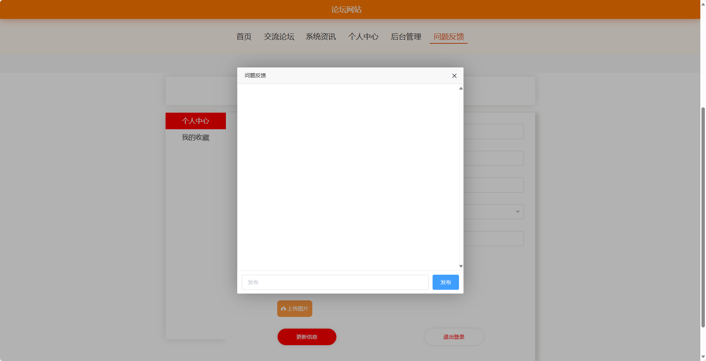

<h1 align="center">基于SpringBoot框架实现的论坛网站【带文档】</h1>

<h4> 完整代码获取地址：从戎源码网（https://armycodes.com/） </h4>
<h4> 作者微信：19941326836 QQ：605739993 QQ群：655392706 </h4>
<h4> 承接计算机毕设、Java毕业设计、Python毕业设计、深度学习、机器学习 </h4>
<h4> 选题+开题报告+任务书+程序定制+安装调试+论文+答辩ppt 一条龙服务 </h4>
<h4> 毕业设计所有选题地址：(https://github.com/Descartes007/allProject) </h4>

## 项目介绍

基于SpringBoot框架实现的论坛网站【带文档】：前端 vue、axios、elementui，后端 springboot、mybatis，系统角色分为：管理员、普通管理员和用户，管理员在管理后台对用户信息、论坛内容管理等；普通管理员可以对帖子进行管理等；用户可以发布论坛信息并对其进行回帖等。主要功能如下：

## 【前台】

首页：展示论坛网站的主页，包括热门帖子、最新资讯等信息。
交流论坛：用户可以在交流论坛中发帖、回帖，与其他用户进行讨论和交流。
系统资讯：展示论坛网站的最新资讯。
个人中心：用户可以在个人中心查看和编辑个人信息，包括头像、昵称、个人简介等。
问题反馈：用户可以向管理员反馈问题。

## 【后台】
### 管理员

个人中心：管理员可以在个人中心查看和编辑个人信息。
用户管理：管理员可以管理用户，包括查看用户列表、编辑用户信息、删除用户等操作。
普通管理员管理：管理员可以管理普通管理员，包括添加新的普通管理员、编辑管理员信息、删除管理员等操作。
论坛类别管理：管理员可以管理论坛的类别，包括添加新的类别、编辑类别信息、删除类别等操作。
交流论坛管理：管理员可以管理交流论坛，包括置顶、删除、编辑帖子、屏蔽用户等操作。
系统管理：管理员可以管理系统设置。

### 普通管理员
个人中心：普通管理员可以在个人中心查看和编辑个人信息。
交流论坛管理：普通管理员可以管理交流论坛，包括置顶、删除、编辑帖子等操作。

### 用户

个人中心：用户可以在个人中心查看和编辑个人信息。
用户管理：用户可以管理自己的账号，包括查看个人信息、编辑个人信息、修改密码等操作。
电影类型管理：用户可以管理电影的类型，包括添加新的类型、编辑类型信息、删除类型等操作。
电影信息管理：用户可以管理电影的信息，包括添加新的电影、编辑电影信息、删除电影等操作。
留言板管理：用户可以管理留言板，包括查看留言、回复留言等操作。
论坛交流：用户可以在论坛中发帖、回帖。
系统管理：用户可以管理系统设置。

## 环境

- <b>IntelliJ IDEA 2020.3</b>

- <b>Mysql 5.7.26</b>

- <b>Maven 3.6.3</b>

- <b>JDK 1.8</b>

## 运行截图

